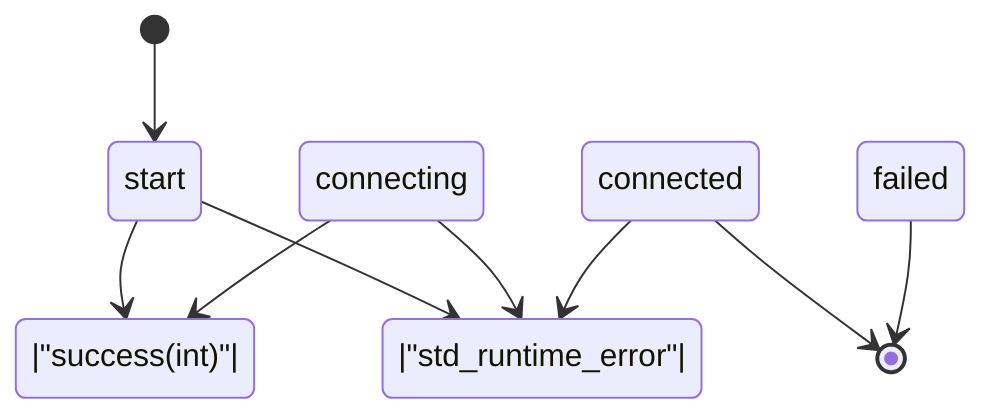
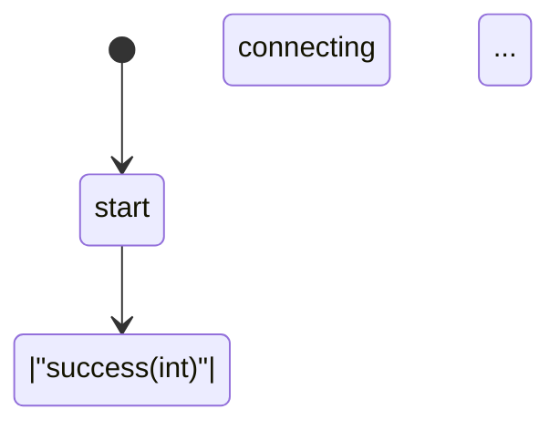

# Template-Based Finite State Machine (FSM)

A modern C++17 template metaprogramming library for type-safe state machines with compile-time validation.

## Features

### ✨ Key Highlights

- **Type Safety**: All states and transitions are validated at compile time
- **Completeness Checking**: Missing transitions are detected at compile time
- **Terminal States**: End states can be explicitly marked
- **Automatic Visualization**: Generates flowcharts in Mermaid and Graphviz DOT formats
- **Zero Runtime Overhead**: Maximum performance through template metaprogramming

## State Machine Visualization

The following diagram shows the example state machine (network connection):



**Legend:**
- 🟢 **start**: Initial state (green)
- 🔴 **failed, connected**: Terminal states (red, double circle)
- ➡️ **Arrows**: State transitions with events as labels

## Quick Start

### Build

```bash
make
```

### Run

```bash
# Normal execution
./fsm

# Generate flowchart
./fsm --flowchart
```

## Usage

### 1. Define States

```cpp
struct start {
    start(SharedContext ctx, std::string ip, std::string user, std::string pass);

    template <typename Callable>
    void operator()(Callable && cb) {
        // State logic
        cb(success<int>(42));
    }
};
```

### 2. Create Transition Table

```cpp
using transitions = std::variant<
    transition<start,      success<sock>,  connecting>,
    transition<start,      exception,      failed>,
    transition<connecting, success<sock>,  connected>,
    transition<connecting, exception,      failed>,
    transition<connected,  exception,      failed>
>;
```

### 3. Mark Terminal States

```cpp
template <> struct is_terminal_state<failed> : std::true_type {};
template <> struct is_terminal_state<connected> : std::true_type {};
```

### 4. Instantiate State Machine

```cpp
state_machine<transitions, SharedContext> fsm(ctx);
fsm.start<start>("10.0.0.50", "user", "pass");
```

## Compile-Time Validation

### Completeness Checking

The state machine validates at compile time that all non-terminal states have transitions defined for all events:

```cpp
static_assert(detail::check_all_transitions<states, events, TransitionTable>(),
    "ERROR: Incomplete transition table! Some states are missing transitions "
    "for certain events. Either add the missing transitions or mark the state "
    "as terminal using is_terminal_state<YourState>.");
```

**Example error when a transition is missing:**

```
error: static assertion failed: ERROR: Incomplete transition table!
Some states are missing transitions for certain events. Either add the
missing transitions or mark the state as terminal using is_terminal_state<YourState>.
```

### Benefits

✅ **Compile-Time Safety**: Errors are caught before execution
✅ **No Forgotten Transitions**: Guarantees complete state machines
✅ **Clear Error Messages**: Shows exactly what's missing
✅ **Terminal States**: Flexibility for end states

## Flowchart Generation

### Mermaid Format

```bash
./fsm --flowchart
```

Output can be used directly in:
- GitHub/GitLab Markdown
- https://mermaid.live
- Confluence, Notion, etc.

### Graphviz DOT Format

The program also generates Graphviz-compatible DOT files:

```bash
./fsm --flowchart > flowchart.txt
# Extract DOT part and save
dot -Tpng flowchart.dot -o fsm.png
```

**Features:**
- Start state: Green filled circle
- Terminal states: Double circle, red filled
- Horizontal layout for better readability

## Architecture

### Core Components

```
fsm.hpp              - State machine template class
├── transition<>     - Transition definition
├── state_machine<>  - Main FSM class
├── is_terminal_state<> - Terminal state marker
└── detail::         - Compile-time validation

meta.hpp             - Template metaprogramming utilities
└── remove_duplicates_t<> - Type-list deduplication

type_name.hpp        - Type introspection
└── type_name<T>()   - Human-readable type names (demangling)
```

### Template Metaprogramming

The library leverages modern C++ features:

- `std::variant` for type-safe state storage
- `constexpr` functions for compile-time computation
- Template specialization for terminal states
- Perfect forwarding for event callbacks

## Example Output

### Normal Execution

```
[start + success<int> > connecting]
[connecting + success<int> > connected]
[connected + std::runtime_error > failed]
* failed: remote disconnect
terminated
```

### Flowchart Generation

```
=== State Machine Flowcharts ===

--- Mermaid Format ---


--- Graphviz DOT Format ---
digraph StateMachine {
    ...
}
```

## Requirements

- **Compiler**: g++ 7+ or clang++ 7+ with C++17 support
- **Standard Library**: C++17 STL (`<variant>`, `<optional>`, etc.)
- **Optional**: Graphviz for PNG/SVG generation

## Build System

```makefile
CXX = g++
CXXFLAGS = -std=c++17 -g -Wall
```

## Advanced Usage

### Custom Context

```cpp
struct MyContext {
    Database db;
    Logger logger;
};

state_machine<transitions, std::shared_ptr<MyContext>> fsm(ctx);
```

### Event Types

Events can be arbitrary C++ types:

```cpp
struct LoginEvent { std::string username; };
struct LogoutEvent {};
struct ErrorEvent { int code; std::string message; };

transition<LoggedOut, LoginEvent,  LoggedIn>
transition<LoggedIn,  LogoutEvent, LoggedOut>
transition<LoggedIn,  ErrorEvent,  Failed>
```

## License

This project is free to use.

## Contributing

Contributions are welcome! Please create a pull request.

---

**Built with modern C++ template metaprogramming** 🚀
