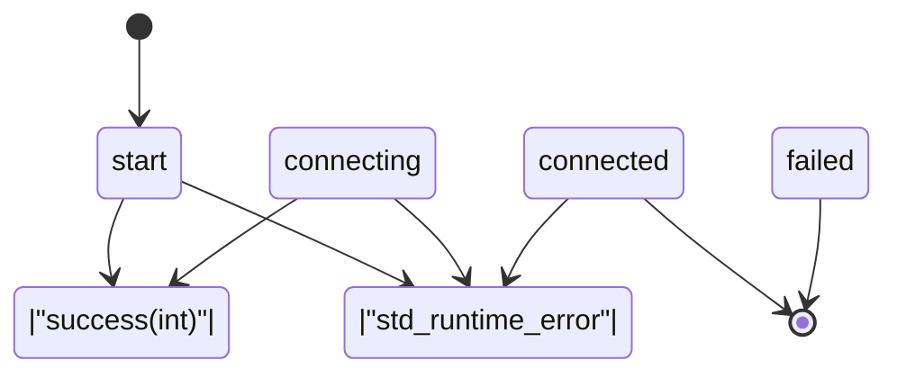
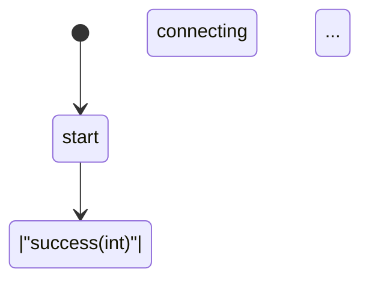

# Template-Based Finite State Machine (FSM)

Eine moderne C++17 Template-Metaprogrammierung-Bibliothek für typsichere Zustandsmaschinen mit Compile-Zeit-Validierung.

## Features

### ✨ Hauptfunktionen

- **Typsicherheit**: Alle Zustände und Übergänge werden zur Compile-Zeit geprüft
- **Vollständigkeitsprüfung**: Fehlende Übergänge werden zur Compile-Zeit erkannt
- **Terminal States**: Endzustände können explizit markiert werden
- **Automatische Visualisierung**: Generiert Flowcharts in Mermaid und Graphviz DOT Format
- **Zero Runtime Overhead**: Maximale Performance durch Template-Metaprogrammierung

## State Machine Visualisierung

Das folgende Diagramm zeigt die Beispiel-State-Machine (Netzwerkverbindung):



**Legende:**
- 🟢 **start**: Startzustand (grün)
- 🔴 **failed, connected**: Terminal States (rot, Doppelkreis)
- ➡️ **Pfeile**: Zustandsübergänge mit Events als Labels

## Schnellstart

### Kompilieren

```bash
make
```

### Ausführen

```bash
# Normale Ausführung
./fsm

# Flowchart generieren
./fsm --flowchart
```

## Verwendung

### 1. Zustände definieren

```cpp
struct start {
    start(SharedContext ctx, std::string ip, std::string user, std::string pass);

    template <typename Callable>
    void operator()(Callable && cb) {
        // Zustandslogik
        cb(success<int>(42));
    }
};
```

### 2. Transition Table erstellen

```cpp
using transitions = std::variant<
    transition<start,      success<sock>,  connecting>,
    transition<start,      exception,      failed>,
    transition<connecting, success<sock>,  connected>,
    transition<connecting, exception,      failed>,
    transition<connected,  exception,      failed>
>;
```

### 3. Terminal States markieren

```cpp
template <> struct is_terminal_state<failed> : std::true_type {};
template <> struct is_terminal_state<connected> : std::true_type {};
```

### 4. State Machine instanziieren

```cpp
state_machine<transitions, SharedContext> fsm(ctx);
fsm.start<start>("10.0.0.50", "user", "pass");
```

## Compile-Zeit-Validierung

### Vollständigkeitsprüfung

Die State Machine prüft zur Compile-Zeit, ob alle nicht-terminalen Zustände für alle Events Übergänge definiert haben:

```cpp
static_assert(detail::check_all_transitions<states, events, TransitionTable>(),
    "ERROR: Incomplete transition table! Some states are missing transitions "
    "for certain events. Either add the missing transitions or mark the state "
    "as terminal using is_terminal_state<YourState>.");
```

**Beispiel-Fehler bei fehlendem Übergang:**

```
error: static assertion failed: ERROR: Incomplete transition table!
Some states are missing transitions for certain events. Either add the
missing transitions or mark the state as terminal using is_terminal_state<YourState>.
```

### Vorteile

✅ **Compile-Zeit-Sicherheit**: Fehler werden vor der Ausführung erkannt
✅ **Keine vergessenen Übergänge**: Garantiert vollständige State Machines
✅ **Klare Fehlermeldungen**: Zeigt genau, was fehlt
✅ **Terminal States**: Flexibilität für Endzustände

## Flowchart-Generierung

### Mermaid Format

```bash
./fsm --flowchart
```

Ausgabe kann direkt verwendet werden in:
- GitHub/GitLab Markdown
- https://mermaid.live
- Confluence, Notion, etc.

### Graphviz DOT Format

Das Programm generiert auch Graphviz-kompatible DOT-Dateien:

```bash
./fsm --flowchart > flowchart.txt
# DOT-Teil extrahieren und speichern
dot -Tpng flowchart.dot -o fsm.png
```

**Features:**
- Start-Zustand: Grün ausgefüllt
- Terminal States: Doppelkreis, rot ausgefüllt
- Horizontales Layout für bessere Lesbarkeit

## Architektur

### Kernkomponenten

```
fsm.hpp              - State Machine Template-Klasse
├── transition<>     - Übergangs-Definition
├── state_machine<>  - Haupt-FSM-Klasse
├── is_terminal_state<> - Terminal State Marker
└── detail::         - Compile-Zeit-Validierung

meta.hpp             - Template-Metaprogrammierung Utilities
└── remove_duplicates_t<> - Type-List Deduplizierung

type_name.hpp        - Type Introspection
└── type_name<T>()   - Lesbare Typnamen (demangling)
```

### Template-Metaprogrammierung

Die Bibliothek nutzt moderne C++ Features:

- `std::variant` für Typ-sichere Zustandsspeicherung
- `constexpr` Funktionen für Compile-Zeit-Berechnungen
- Template Specialization für Terminal States
- Perfect Forwarding für Event-Callbacks

## Beispiel-Output

### Normale Ausführung

```
[start + success<int> > connecting]
[connecting + success<int> > connected]
[connected + std::runtime_error > failed]
* failed: remote disconnect
terminated
```

### Flowchart-Generierung

```
=== State Machine Flowcharts ===

--- Mermaid Format ---


--- Graphviz DOT Format ---
digraph StateMachine {
    ...
}
```

## Anforderungen

- **Compiler**: g++ 7+ oder clang++ 7+ mit C++17 Support
- **Standard Library**: C++17 STL (`<variant>`, `<optional>`, etc.)
- **Optional**: Graphviz für PNG/SVG-Generierung

## Build-System

```makefile
CXX = g++
CXXFLAGS = -std=c++17 -g -Wall
```

## Erweiterte Verwendung

### Custom Context

```cpp
struct MyContext {
    Database db;
    Logger logger;
};

state_machine<transitions, std::shared_ptr<MyContext>> fsm(ctx);
```

### Event-Typen

Events können beliebige C++ Typen sein:

```cpp
struct LoginEvent { std::string username; };
struct LogoutEvent {};
struct ErrorEvent { int code; std::string message; };

transition<LoggedOut, LoginEvent,  LoggedIn>
transition<LoggedIn,  LogoutEvent, LoggedOut>
transition<LoggedIn,  ErrorEvent,  Failed>
```

## Lizenz

Dieses Projekt steht zur freien Verfügung.

## Beiträge

Contributions sind willkommen! Bitte erstellen Sie einen Pull Request.

---

**Entwickelt mit moderner C++ Template-Metaprogrammierung** 🚀
